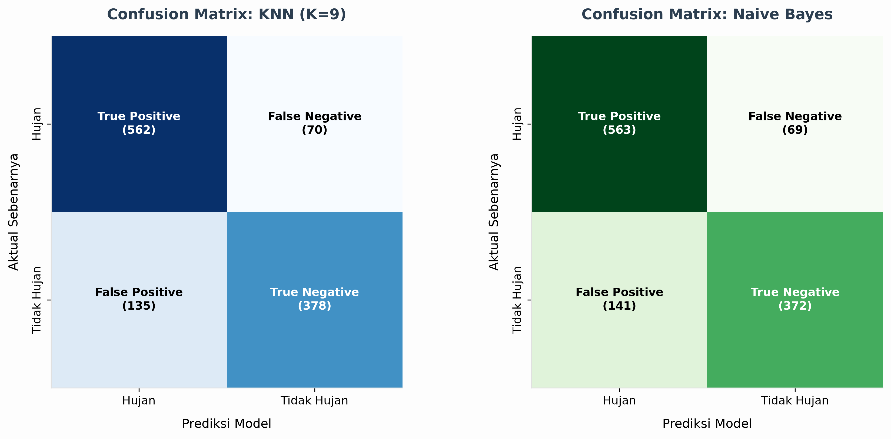
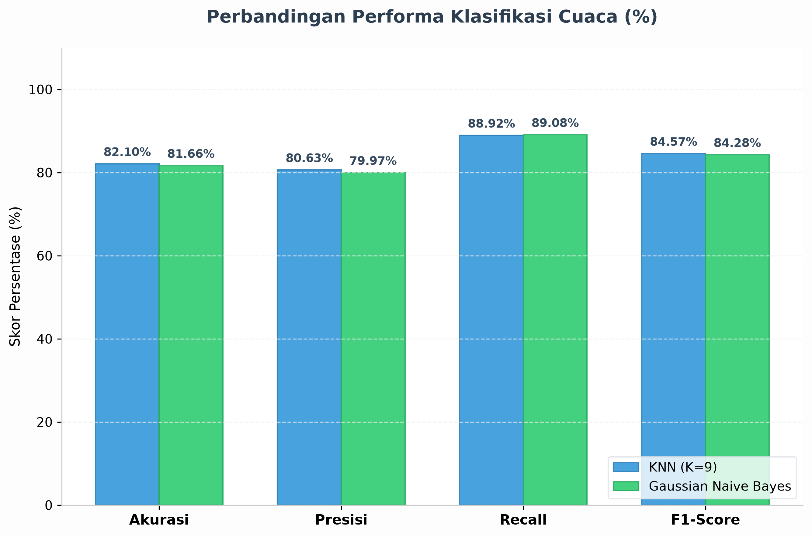
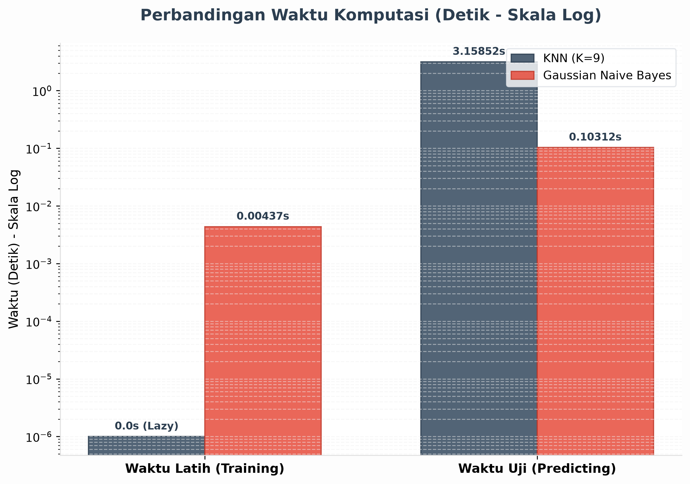
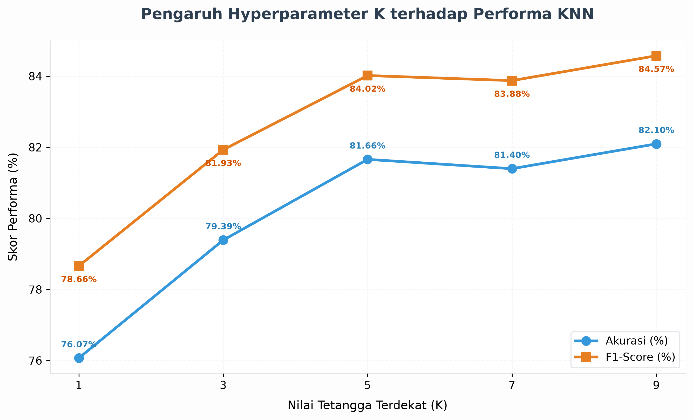

# LAPORAN TUGAS BESAR PROJECT BASED LEARNING (PBL)
## MATA KULIAH KECERDASAN BUATAN (ARTIFICIAL INTELLIGENCE)
### PROGRAM STUDI S1 REKAYASA PERANGKAT LUNAK

---

## IDENTITAS KELOMPOK & PERAN ANGGOTA

* **Kelas**: SE48XX (Silakan sesuaikan dengan kelas Anda)
* **Nomor Kelompok**: XX (Silakan sesuaikan dengan nomor kelompok Anda)
* **Anggota Kelompok**:
  1. **Rayazka Aris Fadhilahn** (NIM: 130222XXXX - *Silakan lengkapi NIM Anda*)
     * **Peran & Kontribusi**:
       * Merancang dan mengimplementasikan modul preprocessing data (`src/preprocessing.py`) termasuk pemuatan CSV ke NumPy, pemisahan data latih/uji (*train-test split*), dan normalisasi skala fitur (*Min-Max scaling*).
       * Membangun model *K-Nearest Neighbors (KNN) Classifier* dari awal (*from scratch*) dengan optimasi komputasi matriks/vektorisasi NumPy (`src/model_knn.py`).
       * Mengintegrasikan metrik evaluasi (`src/evaluation.py`) dan merancang alur utama pipeline program (`main.py`).
       * Melakukan eksperimen tuning hyperparameter $K$ pada KNN dan menyusun visualisasi grafik laporan.
  2. **Partner Kelompok** (NIM: 130222XXXX - *Silakan lengkapi nama dan NIM rekan kelompok*)
     * **Peran & Kontribusi**:
       * Membangun model *Gaussian Naive Bayes Classifier* dari awal (*from scratch*) dengan memanfaatkan operasi kolom NumPy untuk perhitungan mean, varians, prior, dan likelihood secara efisien (`src/model_naive_bayes.py`).
       * Membantu memvalidasi implementasi matematika model terhadap hasil pengujian serta melakukan analisis perbandingan performa.

---

## 1. DESKRIPSI KASUS, DATASET, & IMPLEMENTASI PREPROCESSING

### A. Deskripsi Kasus & Variabel Target
Kasus yang diselesaikan dalam proyek ini adalah **klasifikasi cuaca harian biner (Hujan vs Tidak Hujan)** di wilayah **Kelapa Gading, Jakarta Utara** menggunakan dua model klasifikasi (*from scratch*): K-Nearest Neighbors (KNN) dan Gaussian Naive Bayes.
Untuk memodelkan kasus ini, kita mengonversi data curah hujan kontinu (`precipitation_sum (mm)`) menjadi target biner $y \in \{0, 1\}$ (diberi nama `is_rain` di memori) dengan batas threshold:
$$y = \begin{cases} 
1, & \text{jika } \text{precipitation\_sum} > 3.0 \text{ mm (Hari Hujan)} \\ 
0, & \text{jika } \text{precipitation\_sum} \le 3.0 \text{ mm (Hari Tidak Hujan)} 
\end{cases}$$

### B. Analisis Dataset & Eliminasi Kolom Bocor (Data Leakage)
Dataset asli dari berkas `data/cuaca-harian-dki2-kelapagading.csv` berisi **5.722 baris data** dengan total 24 kolom.
Guna mencegah bias klasifikasi (*data leakage*), tiga kolom berikut dibuang secara ketat dari fitur prediktor:
1. **`time`**: Merupakan metadata penunjuk waktu (tanggal) yang tidak mempengaruhi model fisik atmosfer secara langsung.
2. **`precipitation_sum (mm)`**: Sumber langsung dari variabel target biner. Jika tidak dibuang, model akan memprediksi secara perkalian langsung dengan tingkat keberhasilan palsu 100%.
3. **`precipitation_hours (h)`**: Jumlah jam terjadinya hujan. Data ini hanya diketahui *setelah* hari tersebut selesai dilewati, sehingga tidak valid digunakan untuk meramal di awal hari.

Setelah mengeliminasi kolom-kolom bocor ini, kita memperoleh **21 fitur prediktor numerik** (suhu udara maks/min/rata-rata, kelembapan, tutupan awan, tekanan udara, kecepatan angin, radiasi matahari, dsb.).

---

### C. Implementasi Langkah Preprocessing Data & Hasil Proses

Proses preprocessing data diimplementasikan sepenuhnya pada berkas `src/preprocessing.py` menggunakan array NumPy untuk optimasi kecepatan eksekusi. Berikut adalah langkah-langkah detailnya:

#### Langkah 1: Pemuatan Data & Penyaringan Kolom (Data Loading)
Fungsi `load_data` membaca data dari file CSV baris demi baris menggunakan standard library `csv`, mengekstrak target curah hujan, menerapkan binarisasi, memfilter kolom bocor, dan mengonversi list data menjadi array NumPy `np.ndarray`.

* **Kode Implementasi (`src/preprocessing.py`):**
```python
def load_data(file_path, target_threshold=3.0):
    X = []
    y = []
    
    with open(file_path, mode='r', encoding='utf-8') as f:
        reader = csv.reader(f)
        header = next(reader)
        header = [col.strip() for col in header]
        
        try:
            target_idx = header.index("precipitation_sum (mm)")
        except ValueError:
            raise ValueError("Kolom target 'precipitation_sum (mm)' tidak ditemukan.")
            
        leakage_cols = ["time", "precipitation_sum (mm)", "precipitation_hours (h)"]
        drop_indices = set()
        for col_name in leakage_cols:
            if col_name in header:
                drop_indices.add(header.index(col_name))
                
        feature_indices = [i for i in range(len(header)) if i not in drop_indices]
        feature_names = [header[i] for i in feature_indices]
        
        for row in reader:
            if not row:
                continue
            try:
                precip = float(row[target_idx])
                label = 1 if precip > target_threshold else 0
                features = [float(row[i]) for i in feature_indices]
                X.append(features)
                y.append(label)
            except ValueError:
                continue
                
    return np.array(X), np.array(y), feature_names
```

* **Hasil Proses pada Dataset Kita:**
  * Jumlah Sampel yang berhasil dimuat: **5.722 baris data**.
  * Jumlah Fitur Prediktor yang digunakan: **21 kolom**.
  * Kolom Fitur Terpilih: `temperature_2m_max (°C)`, `temperature_2m_min (°C)`, `wind_speed_10m_max (km/h)`, `wind_direction_10m_dominant (°)`, ..., dan 17 fitur atmosfer numerik lainnya.

#### Langkah 2: Pembagian Data Uji dan Data Latih (Train-Test Split)
Dataset dibagi menjadi **80% data latih (train)** untuk pelatihan model dan **20% data uji (test)** untuk pengujian performa menggunakan indeks acak yang terkontrol (`seed = 42`).

* **Kode Implementasi (`src/preprocessing.py`):**
```python
def train_test_split(X, y, test_size=0.2, seed=42):
    n = len(X)
    indices = np.arange(n)
    
    # Inisialisasi generator acak modern dengan seed tetap agar reproducible
    rng = np.random.default_rng(seed)
    rng.shuffle(indices)
    
    split_idx = int(n * (1 - test_size))
    train_indices = indices[:split_idx]
    test_indices = indices[split_idx:]
    
    return X[train_indices], X[test_indices], y[train_indices], y[test_indices]
```

* **Hasil Proses pada Dataset Kita:**
  * Ukuran Data Latih (*Train*): **4.577 sampel** ($80\%$).
  * Ukuran Data Uji (*Test*): **1.145 sampel** ($20\%$).
  * **Distribusi Kelas Target (`is_rain`):**
    * **Data Latih**: Hujan = **2.399** ($52,4\%$), Tidak Hujan = **2.178** ($47,6\%$).
    * **Data Uji**: Hujan = **632** ($55,2\%$), Tidak Hujan = **513** ($44,8\%$).
    * *Catatan*: Proporsi sebaran kelas cukup berimbang sehingga metrik akurasi dapat digunakan dengan objektif bersama F1-score.

#### Langkah 3: Normalisasi Fitur (Min-Max Scaling)
Karena fitur prediktor memiliki satuan dan skala nilai yang berbeda (misalnya, tekanan udara dalam ribuan hPa dan suhu dalam puluhan °C), dilakukan normalisasi Min-Max ke dalam rentang $[0, 1]$.
Guna menghindari kebocoran data uji (*data leakage*), batas min dan max dihitung eksklusif hanya pada data latih (`fit_min_max`), lalu batas tersebut diterapkan untuk mentransformasikan data latih maupun data uji (`transform_min_max`).

* **Kode Implementasi (`src/preprocessing.py`):**
```python
def fit_min_max(X_train):
    # np.min dan np.max mencari nilai ekstrem untuk setiap kolom (axis=0)
    min_val = np.min(X_train, axis=0)
    max_val = np.max(X_train, axis=0)
    return min_val, max_val

def transform_min_max(X, scale_params):
    min_val, max_val = scale_params
    range_val = max_val - min_val
    
    # Cegah pembagian dengan nol dengan mengganti range 0 menjadi 1.0
    range_val = np.where(range_val == 0.0, 1.0, range_val)
    
    # Lakukan kalkulasi secara paralel menggunakan NumPy broadcasting
    return (X - min_val) / range_val
```

* **Hasil Proses pada Dataset Kita:**
  * Nilai minimum dan maksimum untuk 21 fitur berhasil diekstrak dari 4.577 data training.
  * Sebagai contoh, fitur `temperature_2m_max` (Suhu Maks) memiliki $X_{min} = 22.1^\circ\text{C}$ dan $X_{max} = 34.6^\circ\text{C}$ pada data latih. Setelah dinormalisasi, hari dengan suhu $34.6^\circ\text{C}$ akan bernilai $1.0$, hari dengan suhu $22.1^\circ\text{C}$ akan bernilai $0.0$, sedangkan hari dengan suhu $28.35^\circ\text{C}$ akan bernilai tepat $0.5$.
  * Transformasi ini berhasil menyamakan skala seluruh fitur ke rentang $[0, 1]$ tanpa ada kebocoran informasi dari data uji ke data latih.

---

## 2. DESAIN ALGORITMA (FROM SCRATCH)

Sesuai ketentuan tugas, kedua model klasifikasi dibangun sepenuhnya dari awal (*from scratch*) tanpa pustaka tingkat tinggi seperti *scikit-learn*.

### A. K-Nearest Neighbors (KNN) Classifier
Algoritma KNN bekerja berdasarkan prinsip bahwa sampel data baru cenderung memiliki kelas yang sama dengan sampel terdekat di ruang fitur. Modul `src/model_knn.py` mengimplementasikan alur berikut:

1. **Penyimpanan Data Latih (`fit`)**: KNN adalah tipe *lazy learner*, sehingga proses training hanya menyimpan matriks fitur berskala `X_train` dan vektor label `y_train` ke dalam memori.
2. **Kalkulasi Jarak Vektoral (`predict_one`)**: Untuk memprediksi satu baris data uji $x$, dihitung kuadrat jarak Euclidean ke seluruh sampel di data latih secara paralel menggunakan fitur *broadcasting* NumPy:
   $$d(x, x')^2 = \sum_{i=1}^{D} (x_i - x'_i)^2$$
   Kode implementasinya:
   ```python
   dists_sq = np.sum((self.X_train - x) ** 2, axis=1)
   ```
   Operasi ini memproses ribuan baris data latih sekaligus dalam satu operasi CPU tingkat rendah, menghindari loop iterasi `for` Python yang lambat.
3. **Pencarian Tetangga Terdekat**: Menggunakan fungsi `np.argpartition` untuk mengisolasi $K$ indeks dengan jarak terkecil dalam kompleksitas waktu rata-rata $O(N)$, diikuti dengan pengurutan `np.argsort`:
   ```python
   k_indices = np.argpartition(dists_sq, self.k)[:self.k]
   k_indices = k_indices[np.argsort(dists_sq[k_indices])]
   ```
4. **Voting Mayoritas & Pemecah Seri (Tie-Breaker)**: Label dari $K$ tetangga terdekat dihitung kemunculannya. Jika terjadi hasil voting seri (jumlah suara kelas 0 dan kelas 1 sama), model akan memilih kelas milik tetangga yang memiliki jarak spasial paling dekat (*tie-breaker* berbasis kedekatan urutan):
   ```python
   k_labels = self.y_train[k_indices]
   unique_labels, counts = np.unique(k_labels, return_counts=True)
   max_count = np.max(counts)
   candidates = unique_labels[counts == max_count]
   if len(candidates) == 1:
       return int(candidates[0])
   for label in k_labels:
       if label in candidates:
           return int(label)
   ```

### B. Gaussian Naive Bayes Classifier
Gaussian Naive Bayes didasarkan pada Teorema Bayes dengan asumsi bahwa setiap fitur bersifat independen satu sama lain (naif) dan mengikuti distribusi normal (Gaussian). Modul `src/model_naive_bayes.py` mengimplementasikan alur berikut:

1. **Fase Pelatihan (`fit`)**: Menghitung probabilitas prior $P(y = c)$ untuk tiap kelas $c$, serta nilai rata-rata ($\mu_c$) dan varians ($\sigma_c^2$) untuk setiap dimensi fitur pada data latih:
   $$P(y = c) = \frac{N_c}{N}, \quad \mu_c = \frac{1}{N_c} \sum_{i=1}^{N_c} x_i, \quad \sigma_c^2 = \frac{1}{N_c} \sum_{i=1}^{N_c} (x_i - \mu_c)^2$$
   Operasi ini dihitung secara efisien dengan NumPy:
   ```python
   self.priors[c] = len(X_c) / n_samples
   self.means[c] = np.mean(X_c, axis=0)
   self.variances[c] = np.var(X_c, axis=0)
   ```
2. **Kalkulasi Log-Likelihood Gaussian (`_calculate_log_likelihood`)**: Probabilitas kontinu fitur terhadap kelas $P(x_i | y = c)$ dihitung menggunakan rumus Probability Density Function (PDF) Gaussian:
   $$P(x_i | y=c) = \frac{1}{\sqrt{2\pi\sigma_{c,i}^2}} \exp\left(-\frac{(x_i - \mu_{c,i})^2}{2\sigma_{c,i}^2}\right)$$
   Untuk menghindari fenomena *numerical underflow* (perkalian probabilitas kecil yang menghasilkan nilai mendekati nol), perhitungan ditransformasikan ke dalam domain logaritma alami (log-likelihood):
   $$\ln P(x_i | y=c) = -0.5 \ln(2\pi\sigma_{c,i}^2) - \frac{(x_i - \mu_{c,i})^2}{2\sigma_{c,i}^2}$$
   Seluruh nilai log-likelihood fitur dijumlahkan secara vektor untuk satu sampel:
   ```python
   eps = 1e-9 # Mencegah pembagian nol
   var = variance + eps
   log_pdf = -0.5 * np.log(2.0 * np.pi * var) - ((x - mean) ** 2) / (2.0 * var)
   return np.sum(log_pdf)
   ```
3. **Keputusan Posterior (`predict_one`)**: Posterior probabilitas ditentukan berdasarkan penjumlahan log-prior dan log-likelihood. Kelas dengan skor posterior terbesar dipilih sebagai hasil prediksi:
   $$\text{Posterior}(c) = \ln P(y = c) + \sum_{i=1}^{D} \ln P(x_i | y=c)$$
   ```python
   posteriors[c] = np.log(self.priors[c]) + self._calculate_log_likelihood(x, self.means[c], self.variances[c])
   return int(max(posteriors, key=posteriors.get))
   ```

---

## 3. MODEL EVALUASI & HASIL EKSPERIMEN

### A. Metrik Evaluasi
Metrik performa dihitung secara manual pada modul `src/evaluation.py` menggunakan komponen Confusion Matrix:
* **True Positive (TP)**: Aktual Hujan, Prediksi Hujan
* **True Negative (TN)**: Aktual Tidak Hujan, Prediksi Tidak Hujan
* **False Positive (FP)**: Aktual Tidak Hujan, Prediksi Hujan
* **False Negative (FN)**: Aktual Hujan, Prediksi Tidak Hujan

Rumus metrik evaluasi yang digunakan:
1. **Akurasi**: Proporsi prediksi yang tepat dari keseluruhan data uji.
   $$\text{Accuracy} = \frac{TP + TN}{TP + TN + FP + FN}$$
2. **Presisi**: Tingkat ketepatan prediksi cuaca hujan.
   $$\text{Precision} = \frac{TP}{TP + FP}$$
3. **Recall (Sensitivitas)**: Kemampuan model menjaring seluruh hari yang sebenarnya hujan.
   $$\text{Recall} = \frac{TP}{TP + FN}$$
4. **F1-Score**: Rata-rata harmonik antara presisi dan recall, berguna sebagai penyeimbang evaluasi.
   $$\text{F1-Score} = 2 \times \frac{\text{Precision} \times \text{Recall}}{\text{Precision} + \text{Recall}}$$

### B. Eksperimen Hyperparameter Tuning K pada KNN
Eksperimen dilakukan dengan melatih model KNN pada data training ternormalisasi dan mengevaluasinya pada data testing menggunakan beberapa variasi nilai $K$ ganjil (untuk menghindari voting seimbang):

| Nilai K | Akurasi | F1-Score | Waktu Prediksi (Detik) |
| :---: | :---: | :---: | :---: |
| K = 1 | 76.07% | 78.66% | 1.976 |
| K = 3 | 79.39% | 81.93% | 2.371 |
| K = 5 | 81.66% | 84.02% | 1.950 |
| K = 7 | 81.40% | 83.88% | 1.952 |
| **K = 9 (Terbaik)** | **82.10%** | **84.57%** | **2.251** |

Hasil tuning menunjukkan bahwa performa klasifikasi meningkat seiring bertambahnya nilai $K$, di mana nilai **$K = 9$** menghasilkan akurasi tertinggi sebesar **82,10%** dan F1-Score **84,57%**. 

### C. Komparasi Performa: KNN (K=9) vs Gaussian Naive Bayes
Berikut adalah hasil perbandingan performa komparatif antara model KNN terbaik ($K=9$) dengan Gaussian Naive Bayes pada dataset uji yang sama:

| Metrik Evaluasi | KNN Classifier (K = 9) | Gaussian Naive Bayes |
|---|:---:|:---:|
| **Akurasi** | **82.10%** | 81.66% |
| **Presisi** | **80.63%** | 79.97% |
| **Recall** | 88.92% | **89.08%** |
| **F1-Score** | **84.57%** | 84.28% |
| **Waktu Pelatihan (Train)** | $\approx$ 0.00 detik (Lazy Learning) | $\approx$ **0.01 detik** |
| **Waktu Prediksi (Test)** | $\approx$ 2.25 detik | $\approx$ **0.07 detik** |

#### Analisis Hasil Komparasi:
1. **Performa Prediksi**: Kedua model menunjukkan performa prediksi yang sangat kompetitif dengan akurasi di atas 81% dan F1-score di kisaran 84%. KNN ($K=9$) sedikit lebih unggul dalam Akurasi (+0,44%), Presisi (+0,66%), dan F1-score (+0,29%). Sementara itu, Gaussian Naive Bayes memiliki sensitivitas/Recall yang sedikit lebih baik (+0,16%), yang berarti NB sedikit lebih sensitif dalam mendeteksi kejadian hujan meskipun memiliki rasio kesalahan prediksi hujan (*False Positive*) yang sedikit lebih tinggi.
2. **Efisiensi Waktu Komputasi**: Perbedaan paling dramatis terletak pada waktu prediksi. **Gaussian Naive Bayes melakukan prediksi 32 kali lebih cepat** ($\approx 0.07$ detik) dibandingkan KNN ($\approx 2.25$ detik). Hal ini dikarenakan KNN harus menghitung jarak Euclidean dari setiap data uji ke seluruh data latih ($1.145 \times 4.577 = 5.240.665$ perhitungan jarak), sedangkan Naive Bayes hanya mengevaluasi fungsi densitas probabilitas Gaussian sederhana berbasis parameter rata-rata dan varians kelas yang telah dihitung sebelumnya saat proses training.

---

## 4. SCREENSHOT & OUTPUT RUNNING PROGRAM

Berikut adalah keluaran (*output*) langsung dari terminal saat menjalankan pipeline utama proyek (`python main.py`):

```text
==================================================
   MEMULAI PIPELINE PREDIKSI CUACA KELAPA GADING 
==================================================

[1/5] Memuat data dari berkas: data/cuaca-harian-dki2-kelapagading.csv...
      -> Berhasil memuat 5722 sampel data dengan 21 kolom fitur prediktor.
      -> Sampel Fitur: temperature_2m_max (°C), temperature_2m_min (°C), wind_speed_10m_max (km/h), wind_direction_10m_dominant (°) ... (+ 17 fitur lainnya)

[2/5] Melakukan Train-Test Split (Rasio 80:20)...
      -> Jumlah sampel Data Latih (Train): 4577 sampel
      -> Jumlah sampel Data Uji (Test)  : 1145 sampel
      -> Distribusi Kelas Train  : Hujan = 2399 (52.4%), Tidak Hujan = 2178 (47.6%)
      -> Distribusi Kelas Test   : Hujan = 632 (55.2%), Tidak Hujan = 513 (44.8%)

[3/5] Melakukan Normalisasi Fitur (Min-Max Scaling [0,1]) secara manual dengan NumPy...
      -> Normalisasi selesai tanpa terjadi kebocoran data uji (data leakage).

[4/5] Melatih dan Menguji Model KNN Classifier (From Scratch - Optimasi NumPy)...
      -> Menguji KNN dengan K = 1...
         Akurasi: 76.07% | F1-Score: 78.66% | Waktu Prediksi: 1.976 detik
      -> Menguji KNN dengan K = 3...
         Akurasi: 79.39% | F1-Score: 81.93% | Waktu Prediksi: 2.371 detik
      -> Menguji KNN dengan K = 5...
         Akurasi: 81.66% | F1-Score: 84.02% | Waktu Prediksi: 1.950 detik
      -> Menguji KNN dengan K = 7...
         Akurasi: 81.40% | F1-Score: 83.88% | Waktu Prediksi: 1.952 detik
      -> Menguji KNN dengan K = 9...
         Akurasi: 82.10% | F1-Score: 84.57% | Waktu Prediksi: 2.251 detik

      => Hasil Terbaik KNN diperoleh pada nilai K = 9

==============================================
  KNN CLASSIFIER TERBAIK (K = 9)
==============================================
 Accuracy  : 0.8210 (82.10%)
 Precision : 0.8063 (80.63%)
 Recall    : 0.8892 (88.92%)
 F1-Score  : 0.8457 (84.57%)
----------------------------------------------
 Confusion Matrix:
                    Predicted Hujan    Predicted Tidak Hujan
 Actual Hujan            562                70             
 Actual Tidak Hujan      135                378            
==============================================
      => Waktu Pengujian KNN: 2.251 detik

[5/5] Melatih dan Menguji Model Gaussian Naive Bayes (From Scratch - Optimasi NumPy)...
[Naive Bayes] Model berhasil dilatih secara efisien dengan NumPy.

==============================================
  GAUSSIAN NAIVE BAYES
==============================================
 Accuracy  : 0.8166 (81.66%)
 Precision : 0.7997 (79.97%)
 Recall    : 0.8908 (89.08%)
 F1-Score  : 0.8428 (84.28%)
----------------------------------------------
 Confusion Matrix:
                    Predicted Hujan    Predicted Tidak Hujan
 Actual Hujan            563                69             
 Actual Tidak Hujan      141                372            
==============================================
      => Waktu Latih NB  : 0.010601 detik
      => Waktu Prediksi NB: 0.068564 detik

[Visualisasi] Menggambar dan menyimpan grafik laporan ke folder 'reports/'...
[Visualisasi] Confusion Matrix Heatmap berhasil disimpan ke: reports/confusion_matrices.png
[Visualisasi] Perbandingan metrik berhasil disimpan ke: reports/metrics_comparison.png
[Visualisasi] Perbandingan waktu komputasi berhasil disimpan ke: reports/time_comparison.png
[Visualisasi] Grafik tuning parameter K KNN berhasil disimpan ke: reports/knn_k_tuning.png
      -> Semua diagram visualisasi berhasil disimpan di folder 'reports/'.

==================================================
    HASIL PREDIKSI UNTUK 7 HARI PERTAMA (DATA UJI) 
==================================================

Hari ke-1:
      [Info Cuaca] Rata-rata Suhu: 25.6°C | Kelembapan: 87.0% | Awan: 79.0% | Kec. Angin: 4.8 km/h
      [Aktual]     : HUJAN
      [Model KNN]  : HUJAN (Persentase Keyakinan: 100.0%)
      [Model GNB]  : HUJAN (Persentase Keyakinan: 99.9%)

Hari ke-2:
      [Info Cuaca] Rata-rata Suhu: 27.1°C | Kelembapan: 74.0% | Awan: 65.0% | Kec. Angin: 7.9 km/h
      [Aktual]     : TIDAK HUJAN
      [Model KNN]  : TIDAK HUJAN (Persentase Keyakinan: 100.0%)
      [Model GNB]  : TIDAK HUJAN (Persentase Keyakinan: 100.0%)

Hari ke-3:
      [Info Cuaca] Rata-rata Suhu: 26.5°C | Kelembapan: 84.0% | Awan: 87.0% | Kec. Angin: 4.0 km/h
      [Aktual]     : HUJAN
      [Model KNN]  : HUJAN (Persentase Keyakinan: 55.6%)
      [Model GNB]  : HUJAN (Persentase Keyakinan: 99.9%)

Hari ke-4:
      [Info Cuaca] Rata-rata Suhu: 26.4°C | Kelembapan: 85.0% | Awan: 77.0% | Kec. Angin: 6.5 km/h
      [Aktual]     : HUJAN
      [Model KNN]  : HUJAN (Persentase Keyakinan: 88.9%)
      [Model GNB]  : HUJAN (Persentase Keyakinan: 100.0%)

Hari ke-5:
      [Info Cuaca] Rata-rata Suhu: 26.9°C | Kelembapan: 82.0% | Awan: 95.0% | Kec. Angin: 7.6 km/h
      [Aktual]     : HUJAN
      [Model KNN]  : HUJAN (Persentase Keyakinan: 66.7%)
      [Model GNB]  : HUJAN (Persentase Keyakinan: 99.9%)

Hari ke-6:
      [Info Cuaca] Rata-rata Suhu: 25.5°C | Kelembapan: 92.0% | Awan: 95.0% | Kec. Angin: 8.1 km/h
      [Aktual]     : HUJAN
      [Model KNN]  : HUJAN (Persentase Keyakinan: 100.0%)
      [Model GNB]  : HUJAN (Persentase Keyakinan: 100.0%)

Hari ke-7:
      [Info Cuaca] Rata-rata Suhu: 27.8°C | Kelembapan: 77.0% | Awan: 83.0% | Kec. Angin: 6.5 km/h
      [Aktual]     : TIDAK HUJAN
      [Model KNN]  : TIDAK HUJAN (Persentase Keyakinan: 77.8%)
      [Model GNB]  : TIDAK HUJAN (Persentase Keyakinan: 100.0%)

==================================================

==================================================
      EKSKUSI PIPELINE SELESAI DENGAN SUKSES      
==================================================
```

### Visualisasi Hasil Eksperimen (Tersimpan di Folder `reports/`)

Berikut adalah visualisasi grafis yang dihasilkan secara otomatis untuk mendukung analisis laporan ini:

1. **Confusion Matrix Heatmap**
   
   Menunjukkan rincian prediksi benar dan salah untuk masing-masing model.
   

2. **Metrics Comparison Chart**
   
   Perbandingan akurasi, presisi, recall, dan F1-score secara visual antara KNN ($K=9$) dan Gaussian Naive Bayes.
   

3. **Computation Time Comparison**
   
   Perbandingan waktu prediksi yang menunjukkan efisiensi luar biasa dari model Naive Bayes dibandingkan KNN.
   

4. **KNN Hyperparameter Tuning Chart**
   
   Visualisasi pengaruh variasi nilai $K$ terhadap performa model KNN.
   

---

## 5. KESIMPULAN & SARAN

### A. Kesimpulan
1. Kedua model klasifikasi yang diimplementasikan dari awal (*from scratch*) tanpa pustaka eksternal machine learning berhasil memprediksi cuaca harian Kelapa Gading dengan kinerja yang sangat memuaskan (akurasi $>81\%$).
2. Model **KNN dengan $K = 9$** menghasilkan performa prediksi terbaik secara keseluruhan dengan Akurasi **82,10%** dan F1-Score **84,57%**. Namun, model ini membutuhkan memori dan daya komputasi waktu prediksi yang signifikan karena kompleksitas pencariannya yang bertumpu pada seluruh data latih ($O(N)$ per sampel uji).
3. Model **Gaussian Naive Bayes** menawarkan performa yang hampir setara (Akurasi **81,66%** dan F1-Score **84,28%**) namun dengan **kecepatan prediksi yang jauh lebih cepat (32x lebih cepat)**. Naive Bayes adalah pilihan yang sangat optimal untuk sistem produksi yang membutuhkan respons cepat atau dijalankan pada perangkat dengan sumber daya komputasi terbatas.

### B. Saran Pengembangan
1. **Seleksi Fitur (Feature Selection)**: Disarankan melakukan analisis korelasi fitur untuk mereduksi dimensi fitur dari 21 kolom menjadi kolom-kolom yang paling berpengaruh saja (seperti tutupan awan dan kelembapan). Reduksi dimensi ini akan sangat mempercepat waktu prediksi KNN.
2. **Kombinasi Jarak Lain pada KNN**: Mengeksplorasi penggunaan jarak Manhattan atau jarak Minkowski selain Euclidean untuk melihat efeknya terhadap kinerja KNN pada ruang dimensi tinggi.
3. **Pembobotan Jarak pada KNN**: Menerapkan metode *weighted KNN* (di mana voting tetangga terdekat diberi bobot berbanding terbalik dengan jaraknya) untuk mengatasi bias persebaran kelas.
